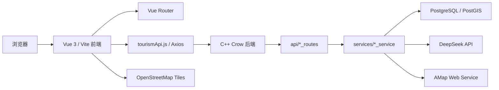
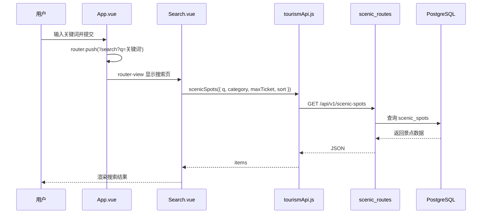
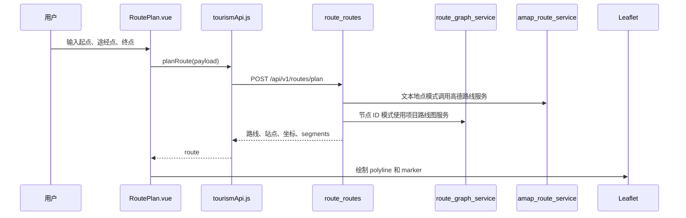
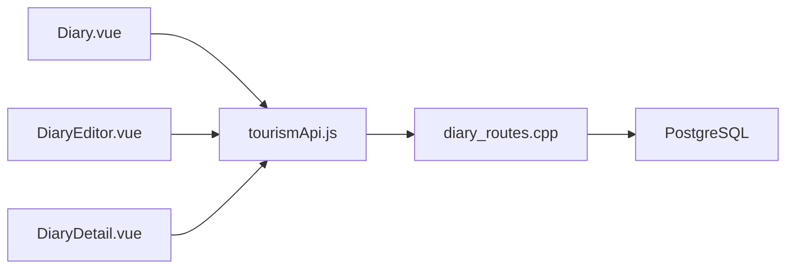
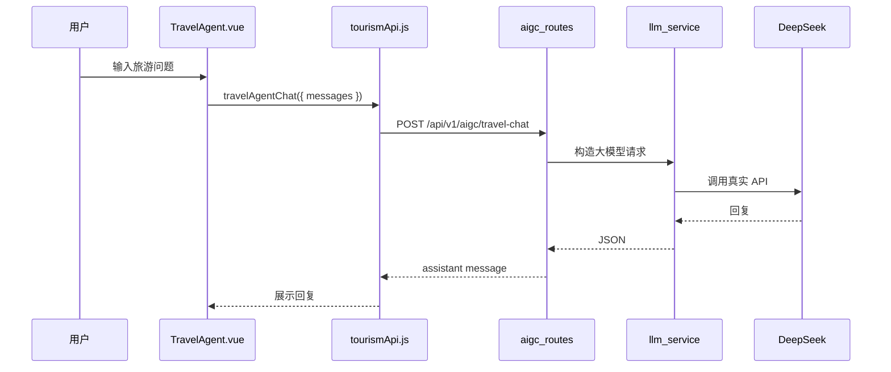

# 系统架构

TourPilot 是一个 Vue 单页应用 + C++ Crow API + PostgreSQL/PostGIS 数据库的旅游规划项目。前端负责交互、页面状态和地图展示；后端负责数据库查询、路线计算、推荐计算和外部 API 调用。

## 总体结构



开发模式下，前端访问 `/api/v1/...`，由 Vite dev server 代理到 `http://127.0.0.1:8080` 后端服务。

## 前端结构

```text
frontend/src/
|-- main.js
|-- App.vue
|-- router/index.js
|-- views/
|-- components/
|-- services/tourismApi.js
|-- data/
|-- stores/
`-- utils/
```

关键点：

- `main.js` 创建 Vue 应用，并导入 Tailwind 与 Leaflet CSS。
- `App.vue` 是根布局，负责顶部导航、全局搜索和 `<router-view />`。
- `router/index.js` 决定 URL 对应哪个页面组件。
- `views/` 是页面级组件，如首页、搜索页、路线页、AI 助手页。
- `services/tourismApi.js` 是前端唯一主力 API 封装。
- `data/demoData.js` 保留后端不可用时的演示 fallback 数据。
- `data/imageCatalog.js` 和 `utils/images.js` 负责本地图片与占位图。
- `utils/recommendation.js` 放推荐计算工具，供首页和推荐页复用。

## 后端结构

```text
backend/src/
|-- main.cpp
|-- api/
|-- services/
|-- db/
|-- support/
`-- graph/
```

`main.cpp` 当前只做启动和注册：

```text
创建 Crow app
  -> register_dashboard_routes
  -> register_profile_routes
  -> register_scenic_routes
  -> register_recommendation_routes
  -> register_route_routes
  -> register_diary_routes
  -> register_aigc_routes
  -> app.run()
```

业务逻辑放在：

- `api/*_routes.cpp`: HTTP 路由、请求参数、响应结构。
- `services/*_service.cpp`: 业务计算、外部 API、复杂 SQL 组装。
- `db/postgres.cpp`: PostgreSQL 连接和查询。
- `support/api_helpers.cpp`: 统一 JSON 响应、参数解析、错误处理辅助。

## 搜索数据流



如果后端不可用，搜索页会尽量使用前端 fallback 演示数据，保证页面仍能展示。

## 路线规划数据流



Leaflet 地图在前端初始化。地图底图来自 OpenStreetMap；路线坐标来自后端接口，接口失败时前端会构造演示路线坐标。

高德 Web Service key 有内置免费默认值；`AMAP_WEB_SERVICE_KEY` 或 `AMAP_KEY` 可覆盖默认值。

## 游记数据流



游记模块当前保留演示用户行为，部分接口默认使用 `user_id = 1`。不要在没有认证系统的情况下假装有完整登录流程。

## AI 助手数据流



如果没有配置 `TOURISM_LLM_API_KEY`，后端返回配置错误；前端不生成假的 AI 回复。

## 图片来源

项目图片来源固定为三层：

1. 后端返回的数据库图片，可能来自高德导入，也可能来自人工录入。
2. 前端本地拼音图片，维护在 `frontend/public/images/diary/` 和 `frontend/src/data/imageCatalog.js`。
3. 前端 SVG 占位图，生成逻辑在 `frontend/src/utils/images.js`。

不要新增远程随机图片 fallback。

## Fallback 数据关系

项目保留两类数据来源：

- 后端真实数据：通过 `/api/v1/...` 查询 PostgreSQL 或外部服务。
- 前端演示数据：`frontend/src/data/demoData.js`，用于后端不可用时保持页面可展示。

维护时要区分二者。fallback 是演示兜底，不是正式数据流。
