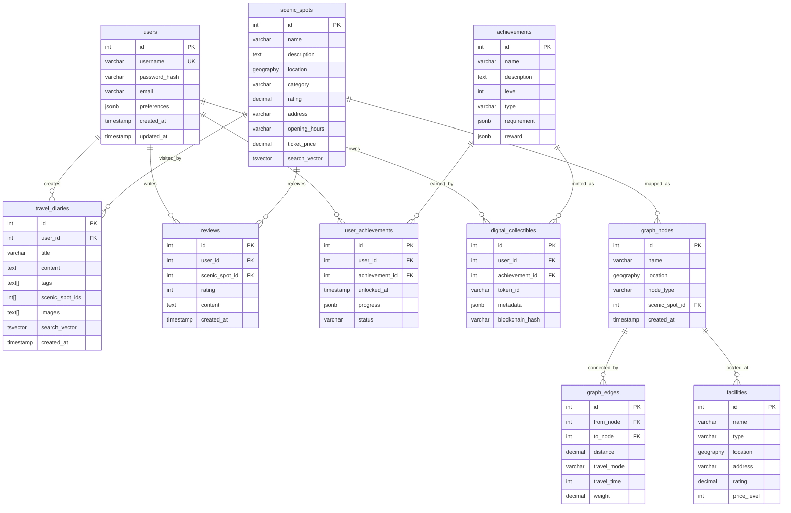

# 个性化旅游系统 - 数据库 ER 图设计

**版本**: v2.0  
**更新日期**: 2026-04-16  
**数据库**: PostgreSQL 15 + PostGIS 3.3

---

## 📊 ER 图总览



---

## 📋 详细表结构设计

### 1. 用户模块 (User Domain)

#### 1.1 用户表 `users`

**用途**: 存储系统用户基本信息

| 字段名 | 数据类型 | 约束 | 说明 | 设计理由 |
|--------|----------|------|------|----------|
| `id` | SERIAL | PRIMARY KEY | 用户唯一标识 | 自增主键，简化关联 |
| `username` | VARCHAR(50) | UNIQUE NOT NULL | 用户名 | 登录凭证，唯一性约束 |
| `password_hash` | VARCHAR(255) | NOT NULL | 密码哈希值 | 存储 bcrypt/argon2 加密后的密码 |
| `email` | VARCHAR(100) | | 邮箱地址 | 用于账号找回、通知 |
| `preferences` | JSONB | | 用户偏好设置 | 灵活存储偏好（类别、预算、距离等） |
| `created_at` | TIMESTAMP | DEFAULT CURRENT_TIMESTAMP | 创建时间 | 审计字段 |
| `updated_at` | TIMESTAMP | DEFAULT CURRENT_TIMESTAMP | 更新时间 | 审计字段 |

**索引**:
- `idx_users_preferences`: GIN 索引 on `preferences` - 支持 JSON 字段查询

**示例数据**:
```json
{
  "id": 1,
  "username": "zhangsan",
  "email": "zhangsan@example.com",
  "preferences": {
    "preferred_categories": ["历史文化", "自然风光"],
    "max_budget": 500,
    "max_distance_km": 50
  }
}
```

---

### 2. 景点模块 (Scenic Spot Domain)

#### 2.1 景点表 `scenic_spots`

**用途**: 存储旅游景点信息，支持空间查询

| 字段名 | 数据类型 | 约束 | 说明 | 设计理由 |
|--------|----------|------|------|----------|
| `id` | SERIAL | PRIMARY KEY | 景点唯一标识 | 自增主键 |
| `name` | VARCHAR(100) | NOT NULL | 景点名称 | 核心展示信息 |
| `description` | TEXT | | 景点详细介绍 | 富文本内容 |
| `location` | GEOGRAPHY(POINT, 4326) | NOT NULL | 地理坐标 | PostGIS 空间类型，支持 WGS84 坐标系 |
| `category` | VARCHAR(50) | | 景点类别 | 如"历史文化"、"自然风光"等 |
| `rating` | DECIMAL(3,2) | | 评分 (0-5) | 用户评价平均分 |
| `address` | VARCHAR(200) | | 详细地址 | 文本地址描述 |
| `opening_hours` | VARCHAR(100) | | 开放时间 | 如"08:30-17:00" |
| `ticket_price` | DECIMAL(10,2) | | 门票价格 | 单位：元 |
| `search_vector` | TSVECTOR | | 全文搜索向量 | PostgreSQL 全文检索 |

**索引**:
- `idx_scenic_spots_location`: GIST 索引 on `location` - 空间查询加速（KNN、范围查询）
- `idx_scenic_spots_search`: GIN 索引 on `search_vector` - 全文检索加速

**空间查询示例**:
```sql
-- KNN 最近邻查询（使用 GIST 索引优化）
SELECT name, ST_Distance(location, ref_point)
FROM scenic_spots
ORDER BY location <-> ST_MakePoint(116.4, 39.9)::geography
LIMIT 10;

-- 范围查询
SELECT * FROM scenic_spots
WHERE ST_DWithin(location, ST_MakePoint(116.4, 39.9)::geography, 5000);
```

---

### 3. 图结构模块 (Graph Domain)

#### 3.1 图节点表 `graph_nodes`

**用途**: 存储路径规划图的节点（景点、路口、设施点）

| 字段名 | 数据类型 | 约束 | 说明 | 设计理由 |
|--------|----------|------|------|----------|
| `id` | SERIAL | PRIMARY KEY | 节点唯一标识 | 自增主键 |
| `name` | VARCHAR(100) | NOT NULL | 节点名称 | 如"故宫东门"、"路口 A" |
| `location` | GEOGRAPHY(POINT, 4326) | | 地理坐标 | 用于空间查询和距离计算 |
| `node_type` | VARCHAR(20) | | 节点类型 | scenic/facility/junction/custom |
| `scenic_spot_id` | INTEGER | FK REFERENCES scenic_spots(id) | 关联景点 ID | 如果是景点节点，关联到景点表 |
| `created_at` | TIMESTAMP | DEFAULT CURRENT_TIMESTAMP | 创建时间 | 审计字段 |

**索引**:
- `idx_graph_nodes_location`: GIST 索引 on `location` - 空间查询加速

**节点类型说明**:
- `scenic`: 景点节点（关联 scenic_spots）
- `facility`: 设施节点（关联 facilities）
- `junction`: 路口/交通节点
- `custom`: 自定义节点

#### 3.2 图边表 `graph_edges`

**用途**: 存储节点间的连接关系（路径段）

| 字段名 | 数据类型 | 约束 | 说明 | 设计理由 |
|--------|----------|------|------|----------|
| `id` | SERIAL | PRIMARY KEY | 边唯一标识 | 自增主键 |
| `from_node` | INTEGER | NOT NULL FK REFERENCES graph_nodes(id) | 起始节点 ID | 外键关联 |
| `to_node` | INTEGER | NOT NULL FK REFERENCES graph_nodes(id) | 目标节点 ID | 外键关联 |
| `distance` | DECIMAL(10,2) | | 距离（米） | 实际路径长度 |
| `travel_mode` | VARCHAR(20) | | 交通方式 | walk/bike/car/bus/subway |
| `travel_time` | INTEGER | | 预计时间（分钟） | 基于交通方式计算 |
| `weight` | DECIMAL(10,2) | DEFAULT 1.0 | 权重 | Dijkstra 算法使用，可动态调整 |
| `created_at` | TIMESTAMP | DEFAULT CURRENT_TIMESTAMP | 创建时间 | 审计字段 |

**索引**:
- `idx_edges_from`: 普通索引 on `from_node` - 加速邻接查询
- `idx_edges_to`: 普通索引 on `to_node` - 加速反向查询
- `idx_edges_mode`: 普通索引 on `travel_mode` - 交通方式过滤

**Dijkstra 算法查询**:
```sql
-- 获取节点的邻居边
SELECT * FROM graph_edges
WHERE from_node = 123
ORDER BY weight;
```

---

### 4. 设施模块 (Facility Domain)

#### 4.1 设施表 `facilities`

**用途**: 存储旅游服务设施（餐厅、酒店、卫生间等）

| 字段名 | 数据类型 | 约束 | 说明 | 设计理由 |
|--------|----------|------|------|----------|
| `id` | SERIAL | PRIMARY KEY | 设施唯一标识 | 自增主键 |
| `name` | VARCHAR(100) | NOT NULL | 设施名称 | 如"肯德基前门店" |
| `type` | VARCHAR(50) | | 设施类型 | 餐厅/酒店/卫生间/停车场等 |
| `location` | GEOGRAPHY(POINT, 4326) | | 地理坐标 | 空间查询 |
| `address` | VARCHAR(200) | | 详细地址 | 文本地址 |
| `rating` | DECIMAL(3,2) | | 评分 | 用户评价 |
| `price_level` | INTEGER | | 价格等级 | 1-4（便宜到贵） |

**索引**:
- `idx_facilities_location`: GIST 索引 on `location` - 周边设施查询

**设施类型枚举**:
- 餐厅、咖啡厅、酒店
- 地铁站、公交站
- 卫生间、停车场
- 医院、警察局
- 购物中心

---

### 5. 游记模块 (Travel Diary Domain)

#### 5.1 游记表 `travel_diaries`

**用途**: 存储用户旅行游记

| 字段名 | 数据类型 | 约束 | 说明 | 设计理由 |
|--------|----------|------|------|----------|
| `id` | SERIAL | PRIMARY KEY | 游记唯一标识 | 自增主键 |
| `user_id` | INTEGER | FK REFERENCES users(id) | 作者用户 ID | 外键关联 |
| `title` | VARCHAR(200) | NOT NULL | 游记标题 | 展示用 |
| `content` | TEXT | NOT NULL | 游记正文 | 富文本内容 |
| `tags` | TEXT[] | | 标签数组 | 如 ["北京", "三日游", "美食"] |
| `scenic_spot_ids` | INTEGER[] | | 景点 ID 数组 | 游览过的景点列表 |
| `images` | TEXT[] | | 图片 URL 数组 | 游记配图 |
| `search_vector` | TSVECTOR | | 全文搜索向量 | 全文检索 |
| `created_at` | TIMESTAMP | DEFAULT CURRENT_TIMESTAMP | 创建时间 | 排序用 |
| `updated_at` | TIMESTAMP | DEFAULT CURRENT_TIMESTAMP | 更新时间 | 审计字段 |

**索引**:
- `idx_diaries_search`: GIN 索引 on `search_vector` - 全文检索
- `idx_diaries_tags`: GIN 索引 on `tags` - 标签过滤
- `idx_diaries_user`: 普通索引 on `user_id` - 用户游记查询

**全文检索示例**:
```sql
-- 搜索包含"故宫"的游记
SELECT title, user_id
FROM travel_diaries
WHERE search_vector @@ to_tsquery('simple', '故宫')
ORDER BY created_at DESC;
```

---

### 6. 评价模块 (Review Domain)

#### 6.1 评价表 `reviews`

**用途**: 存储用户对景点的评价

| 字段名 | 数据类型 | 约束 | 说明 | 设计理由 |
|--------|----------|------|------|----------|
| `id` | SERIAL | PRIMARY KEY | 评价唯一标识 | 自增主键 |
| `user_id` | INTEGER | FK REFERENCES users(id) | 评价者用户 ID | 外键关联 |
| `scenic_spot_id` | INTEGER | FK REFERENCES scenic_spots(id) | 被评价景点 ID | 外键关联 |
| `rating` | INTEGER | CHECK (1-5) | 评分 (1-5 星) | CHECK 约束保证有效性 |
| `content` | TEXT | | 评价内容 | 文字评价 |
| `created_at` | TIMESTAMP | DEFAULT CURRENT_TIMESTAMP | 创建时间 | 排序用 |

**索引**:
- `idx_reviews_user`: 普通索引 on `user_id` - 用户评价查询
- `idx_reviews_spot`: 普通索引 on `scenic_spot_id` - 景点评价聚合

**评分更新触发器**（简化版）:
```sql
-- 更新景点平均评分
UPDATE scenic_spots
SET rating = (
    SELECT AVG(rating) FROM reviews
    WHERE scenic_spot_id = scenic_spots.id
)
WHERE id = 123;
```

---

### 7. 成就系统模块 (Achievement Domain)

#### 7.1 成就表 `achievements`

**用途**: 定义系统成就（4 层 progressive 架构）

| 字段名 | 数据类型 | 约束 | 说明 | 设计理由 |
|--------|----------|------|------|----------|
| `id` | SERIAL | PRIMARY KEY | 成就唯一标识 | 自增主键 |
| `name` | VARCHAR(100) | NOT NULL | 成就名称 | 如"故宫打卡者" |
| `description` | TEXT | | 成就描述 | 说明成就要求 |
| `level` | INTEGER | | 成就层级 | 1-4（L1 基础→L4 大师） |
| `type` | VARCHAR(50) | | 成就类型 | 打卡/探索/创作/大师 |
| `requirement` | JSONB | | 解锁要求 | 灵活定义条件 |
| `reward` | JSONB | | 奖励内容 | 积分/徽章/数字藏品 |
| `created_at` | TIMESTAMP | DEFAULT CURRENT_TIMESTAMP | 创建时间 | 审计字段 |

**JSONB 示例**:
```json
// requirement
{
  "type": "visit_count",
  "target": 10,
  "category": "历史文化"
}

// reward
{
  "points": 100,
  "badge_icon": "url_to_icon.png",
  "digital_collectible": true
}
```

**成就层级设计**（4 层 progressive）:
- **L1 基础成就**: 打卡签到类（访问 N 个景点）
- **L2 主题成就**: 主题探索类（访问特定类别景点）
- **L3 创作成就**: 内容创作类（发布游记、评价）
- **L4 大师成就**: 综合认证类（完成高难度挑战）

#### 7.2 用户成就表 `user_achievements`

**用途**: 记录用户解锁的成就及进度

| 字段名 | 数据类型 | 约束 | 说明 | 设计理由 |
|--------|----------|------|------|----------|
| `id` | SERIAL | PRIMARY KEY | 记录唯一标识 | 自增主键 |
| `user_id` | INTEGER | FK REFERENCES users(id) | 用户 ID | 外键关联 |
| `achievement_id` | INTEGER | FK REFERENCES achievements(id) | 成就 ID | 外键关联 |
| `unlocked_at` | TIMESTAMP | DEFAULT CURRENT_TIMESTAMP | 解锁时间 | 成就获得时间 |
| `progress` | JSONB | | 完成进度 | 记录当前进度 |
| `status` | VARCHAR(20) | DEFAULT 'locked' | 状态 | locked/in_progress/unlocked |

**索引**:
- `idx_user_achievements_user`: 普通索引 on `user_id` - 用户成就查询
- `idx_user_achievements_status`: 普通索引 on `status` - 状态过滤

**进度追踪示例**:
```json
// progress
{
  "current": 5,
  "target": 10,
  "percentage": 50
}
```

#### 7.3 数字藏品表 `digital_collectibles`

**用途**: 存储成就对应的数字藏品（NFT 概念）

| 字段名 | 数据类型 | 约束 | 说明 | 设计理由 |
|--------|----------|------|------|----------|
| `id` | SERIAL | PRIMARY KEY | 藏品唯一标识 | 自增主键 |
| `user_id` | INTEGER | FK REFERENCES users(id) | 所有者用户 ID | 外键关联 |
| `achievement_id` | INTEGER | FK REFERENCES achievements(id) | 关联成就 ID | 外键关联 |
| `token_id` | VARCHAR(100) | | 代币 ID | 唯一标识符 |
| `metadata` | JSONB | | 元数据 | 藏品属性、图片等 |
| `blockchain_hash` | VARCHAR(200) | | 区块链哈希 | 存证哈希值（可选） |
| `created_at` | TIMESTAMP | DEFAULT CURRENT_TIMESTAMP | 创建时间 | 铸造时间 |

**索引**:
- `idx_collectibles_user`: 普通索引 on `user_id` - 用户藏品查询
- `idx_collectibles_token`: 普通索引 on `token_id` - 唯一性查询

**创新点**: **数字藏品 + 实体徽章 互补优势**
- 数字藏品：虚拟展示、社交分享、可交易
- 实体徽章：实物收藏、纪念意义、线下活动

---

## 🔗 表关系说明

### 核心关系图

```
users (用户)
├── creates → travel_diaries (游记)
├── writes → reviews (评价)
├── unlocks → user_achievements (用户成就)
│               └── earned_from → achievements (成就)
└── owns → digital_collectibles (数字藏品)
                └── minted_from → achievements (成就)

scenic_spots (景点)
├── mapped_as → graph_nodes (图节点)
│               └── connected_by → graph_edges (图边)
├── receives → reviews (评价)
└── visited_by → travel_diaries (游记)

facilities (设施)
└── located_at → graph_nodes (图节点)
```

### 外键关系表

| 子表 | 父表 | 外键字段 | 关系类型 | 删除策略 |
|------|------|----------|----------|----------|
| graph_nodes | scenic_spots | scenic_spot_id | N:1 | SET NULL |
| graph_edges | graph_nodes | from_node, to_node | N:1 | RESTRICT |
| travel_diaries | users | user_id | N:1 | CASCADE |
| reviews | users | user_id | N:1 | CASCADE |
| reviews | scenic_spots | scenic_spot_id | N:1 | CASCADE |
| user_achievements | users | user_id | N:1 | CASCADE |
| user_achievements | achievements | achievement_id | N:1 | RESTRICT |
| digital_collectibles | users | user_id | N:1 | CASCADE |
| digital_collectibles | achievements | achievement_id | N:1 | RESTRICT |

---

## 🎯 设计亮点

### 1. 空间数据优化

**PostGIS 技术应用**:
- 使用 `GEOGRAPHY(POINT, 4326)` 存储经纬度
- GIST 空间索引加速 KNN 查询
- 支持非直线距离计算（实际道路距离）

**查询优化**:
```sql
-- KNN 最近邻查询（O(logN) 复杂度）
SELECT * FROM scenic_spots
ORDER BY location <-> ref_point
LIMIT 10;

-- 范围查询（使用 GIST 索引）
SELECT * FROM facilities
WHERE ST_DWithin(location, ref_point, 5000);
```

### 2. 全文检索优化

**PostgreSQL 全文检索**:
- 使用 `TSVECTOR` 存储搜索向量
- GIN 索引加速匹配
- 支持中文分词（需配置）

```sql
-- 全文检索游记
SELECT * FROM travel_diaries
WHERE search_vector @@ to_tsquery('simple', '故宫 & 美食');
```

### 3. 灵活的 JSONB 字段

**使用场景**:
- `users.preferences`: 用户偏好（类别、预算、距离）
- `achievements.requirement`: 成就解锁条件
- `achievements.reward`: 成就奖励内容
- `user_achievements.progress`: 成就进度追踪

**优势**:
- 灵活扩展，无需修改表结构
- 支持复杂嵌套结构
- PostgreSQL 提供丰富操作符

### 4. 图数据结构设计

**邻接表存储**:
- `graph_nodes`: 节点表（景点、路口、设施）
- `graph_edges`: 边表（路径段）
- 支持多交通方式（walk/bike/car/bus/subway）
- 动态权重更新（基于拥挤度）

**Dijkstra 算法支持**:
```cpp
// C++ 实现（见 backend/src/graph/dijkstra.cpp）
PathResult dijkstra(const Graph& graph, int64_t start, int64_t end);
// 时间复杂度：O((V+E)logV)
```

### 5. 成就系统架构

**4 层 Progressive 设计**:
```
L1 基础成就（打卡签到）
  ↓
L2 主题成就（探索分类）
  ↓
L3 创作成就（内容产出）
  ↓
L4 大师成就（综合认证）
```

**数字藏品 + 实体徽章**:
- 虚拟与实物结合
- 增强用户粘性
- 社交分享激励

---

## 📊 数据规模估算

### 目标数据量

| 表名 | 目标记录数 | 说明 |
|------|------------|------|
| users | 1,000+ | 测试用户 |
| scenic_spots | 200+ | 核心景点 |
| graph_nodes | 200+ | 图节点 |
| graph_edges | 500+ | 路径边 |
| facilities | 50+ | 服务设施（10+ 类型） |
| travel_diaries | 100+ | 示例游记 |
| reviews | 500+ | 用户评价 |
| achievements | 40+ | 4 层 × 10 个/层 |
| user_achievements | 1,000+ | 用户成就记录 |
| digital_collectibles | 100+ | 数字藏品 |

### 性能要求

| 操作类型 | 目标响应时间 | 优化手段 |
|----------|--------------|----------|
| 景点列表查询 | < 100ms | GIST 空间索引 |
| 路径规划（Dijkstra） | < 50ms | 优先队列优化 |
| 全文检索 | < 50ms | GIN 全文索引 |
| 周边设施查询 | < 80ms | GIST 空间索引 |
| 用户成就查询 | < 30ms | 普通索引 |

---

## 🔧 数据库维护

### 定期任务

```sql
-- 刷新物化视图（如果有）
REFRESH MATERIALIZED VIEW CONCURRENTLY mv_hot_spots;

-- 更新统计信息
ANALYZE scenic_spots;
ANALYZE graph_edges;

-- 清理过期日志
DELETE FROM api_access_logs
WHERE created_at < CURRENT_TIMESTAMP - INTERVAL '30 days';
```

### 备份策略

```bash
# 全量备份
pg_dump -U postgres tourism_system > backup_$(date +%Y%m%d).sql

# 恢复
psql -U postgres -d tourism_system < backup_20260416.sql
```

---

## 📝 版本历史

| 版本 | 日期 | 更新内容 |
|------|------|----------|
| v1.0 | 2026-03-31 | 初始版本（10 张核心表） |
| v2.0 | 2026-04-16 | 完善 ER 图、添加设计理由说明 |

---

**文档维护者**: yhm, zby, lxd  
**课程**: 数据结构课程设计  
**项目名称**: 个性化旅游系统
