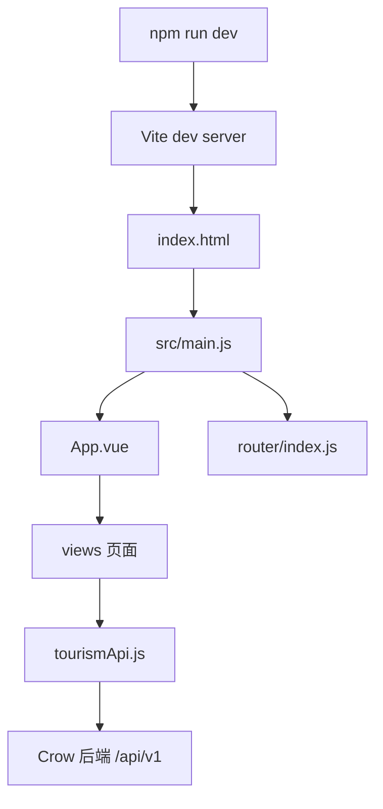

# 前端学习说明

本文面向初学者解释当前 Vue 3 前端的组织方式和运行链路。

## 前端结构树

```text
frontend/
|-- index.html
|-- package.json
|-- vite.config.js
|-- scripts/
|   |-- vite-dev.mjs
|   |-- vite-preview.mjs
|   `-- vite-runtime-config.mjs
`-- src/
    |-- main.js
    |-- App.vue
    |-- index.css
    |-- router/
    |   `-- index.js
    |-- views/
    |   |-- Home.vue
    |   |-- Search.vue
    |   |-- ScenicDetail.vue
    |   |-- Recommendation.vue
    |   |-- RoutePlan.vue
    |   |-- TravelAgent.vue
    |   |-- Diary.vue
    |   |-- DiaryEditor.vue
    |   |-- DiaryDetail.vue
    |   |-- Achievements.vue
    |   `-- Profile.vue
    |-- components/
    |   `-- DiaryPostcard.vue
    |-- services/
    |   `-- tourismApi.js
    |-- data/
    |   |-- demoData.js
    |   `-- imageCatalog.js
    |-- stores/
    |   `-- diaryStore.js
    `-- utils/
        |-- images.js
        `-- recommendation.js
```

## 前端怎么跑起来

运行：

```powershell
cd frontend
npm run dev
```

实际执行：

```text
node scripts/vite-dev.mjs
```

运行链路：

```text
index.html
  -> src/main.js
  -> createApp(App)
  -> app.use(router)
  -> app.mount('#app')
  -> App.vue
  -> router-view
  -> 当前 URL 对应的 views 页面
```

`index.html` 只提供挂载点。真正创建 Vue 应用的是 `src/main.js`。

## main.js

`frontend/src/main.js` 做几件事：

- 导入 `App.vue` 根组件。
- 导入 `router/index.js` 路由。
- 导入 `index.css`，让 Tailwind CSS 生效。
- 导入 `leaflet/dist/leaflet.css`，让 Leaflet 地图控件样式生效。
- `createApp(App)` 创建 Vue 应用。
- `app.use(router)` 安装 Vue Router。
- `app.mount('#app')` 挂载到 `index.html` 的 `<div id="app"></div>`。

## App.vue

`App.vue` 是整个前端的根布局，不是首页本身。

它负责：

- 顶部 logo。
- 桌面端搜索框。
- 移动端搜索框。
- 桌面端导航栏。
- 移动端导航栏。
- 个人中心入口。
- `<router-view />` 页面出口。

导航数组类似：

```js
const navItems = [
  { to: '/', label: '首页' },
  { to: '/search', label: '发现景点' },
  { to: '/recommend', label: '预算推荐' }
]
```

模板中：

```vue
<router-link v-for="item in navItems" :key="item.to" :to="item.to">
  {{ item.label }}
</router-link>
```

意思是数组里有几个 `item`，就生成几个导航链接。`router-link` 是 Vue Router 的链接组件，点击后不会刷新整个网页，而是在单页应用内部切换页面。

搜索表单：

```vue
<form @submit.prevent="submitSearch">
  <input v-model="keyword" type="search">
</form>
```

- `v-model="keyword"`: 输入框内容和 `keyword` 变量双向绑定。
- `@submit.prevent`: 表单提交时阻止浏览器默认刷新页面。
- `submitSearch`: 把关键词拼到 URL，跳转到 `/search?q=关键词`。

`App.vue` 不直接搜索数据，它只负责跳转。真正加载搜索结果的是 `Search.vue`。

## 为什么同一个网址下能显示不同页面

项目是单页应用。浏览器只加载一次 Vue 应用，之后不同 URL 对应不同组件。

示例：

```text
/              -> Home.vue
/search?q=故宫 -> Search.vue
/spots/1       -> ScenicDetail.vue
/route         -> RoutePlan.vue
/agent         -> TravelAgent.vue
```

`App.vue` 中的 `<router-view />` 是页面插槽。当前路由匹配到哪个页面组件，它就显示哪个页面组件。

所以顶部导航一直在，是因为导航属于 `App.vue`；下面内容会变化，是因为下面是 `router-view`。

## views 页面组件

`views/` 中的组件是页面级组件：

- `Home.vue`: 首页、推荐入口、预算路线展示。
- `Search.vue`: 搜索结果、筛选、排序、建议词。
- `ScenicDetail.vue`: 景点详情。
- `Recommendation.vue`: 推荐页。
- `RoutePlan.vue`: 路线规划和 Leaflet 地图。
- `TravelAgent.vue`: AI 旅游助手。
- `Diary.vue`: 游记广场。
- `DiaryEditor.vue`: 游记创建和编辑。
- `DiaryDetail.vue`: 游记详情。
- `Achievements.vue`: 成就页。
- `Profile.vue`: 个人中心和偏好。

页面组件通常自己调用 API、管理 `loading/error` 状态，并渲染数据。

## components 复用组件

当前主要复用组件是：

- `components/DiaryPostcard.vue`: 游记卡片。

父组件通过 props 把游记数据传给它，子组件负责展示卡片 UI。如果子组件需要通知父组件，一般会用 `defineEmits` 发事件。

有些页面没有 `defineProps` 或 `defineEmits`，是因为它们是页面组件，不是被其他组件复用的子组件。

## services 层

`frontend/src/services/tourismApi.js` 是前端 API 统一入口。

它用 Axios 创建 client：

```js
const client = axios.create({
  baseURL: '/api/v1',
  timeout: 30000
})
```

所以：

```js
client.get('/scenic-spots')
```

实际请求：

```text
/api/v1/scenic-spots
```

开发环境下，Vite 会把 `/api` 代理到后端 `http://127.0.0.1:8080`。

常见函数：

- `scenicSpots(params)`: 搜索或获取景点列表。
- `searchSuggestions(params)`: 获取搜索建议。
- `scenicSpot(id)`: 获取景点详情。
- `budgetPlans(params)`: 获取预算方案。
- `planRoute(payload)`: 提交路线规划。
- `personalizedRecommendations(payload)`: 个性化推荐。
- `diaries(params)`: 游记列表。
- `travelAgentChat(payload)`: AI 旅游助手。

## Tailwind CSS

`main.js` 中导入：

```js
import './index.css'
```

`index.css` 是 Tailwind 入口。组件模板里的这些 class 都是 Tailwind 工具类：

- `flex`
- `grid`
- `text-sm`
- `rounded-md`
- `bg-slate-50`
- `md:block`
- `lg:hidden`

它们不是普通自定义 class，而是 Tailwind 根据 class 名生成的 CSS。

例如：

- `flex`: `display: flex`。
- `text-sm`: 小字号。
- `rounded-md`: 中等圆角。
- `md:block`: 屏幕达到 md 断点时显示为 block。
- `lg:hidden`: 屏幕达到 lg 断点时隐藏。

Tailwind 适合快速写布局和响应式样式。普通 scoped CSS 更适合写组件里复杂或无法用工具类表达的样式。

## Leaflet 地图

地图相关页面：

- `frontend/src/views/RoutePlan.vue`

项目在 `main.js` 导入：

```js
import 'leaflet/dist/leaflet.css'
```

作用是让 Leaflet 的地图控件、缩放按钮、marker 等默认样式生效。

路线页中有地图容器：

```vue
<div ref="mapContainer" class="h-[520px] w-full"></div>
```

页面挂载后初始化地图：

```js
map = L.map(mapContainer.value).setView([39.916, 116.397], 13)
```

路线规划成功后，页面根据接口返回的坐标绘制：

- `L.polyline(...)`: 路线折线。
- `L.circleMarker(...)`: 站点 marker。

地图底图来自 OpenStreetMap；路线数据来自后端 `/api/v1/routes/plan` 或前端 fallback。

## 图片来源

景点图片的选择顺序在 `frontend/src/utils/images.js`：

1. 接口返回图片。
2. 本地拼音图片，映射在 `frontend/src/data/imageCatalog.js`。
3. SVG 占位图。

后端不再提供外部随机图片 fallback，前端也不使用随机远程图片兜底。

## TravelAgent AI 助手

页面：

- `frontend/src/views/TravelAgent.vue`

前端发送用户消息：

```js
tourismApi.travelAgentChat({ messages })
```

后端接口：

```text
POST /api/v1/aigc/travel-chat
```

后端通过 `llm_service.cpp` 调用真实大模型 API。没有配置 DeepSeek key 时，接口返回配置错误，不生成假回复。

## 最应该掌握的 Vue 3 知识点

- `createApp`: 创建应用。
- `ref` / `reactive`: 声明响应式状态。
- `v-model`: 表单双向绑定。
- `v-for`: 循环渲染。
- `v-if` / `v-else`: 条件渲染。
- `@click` / `@submit.prevent`: 事件绑定。
- `onMounted`: 页面挂载后加载数据或初始化地图。
- `watch`: 监听路由和筛选条件变化。
- `useRoute` / `useRouter`: 读取当前 URL 和执行跳转。
- `router-view`: 显示当前路由页面。
- `props` / `emit`: 父子组件通信。

## 运行流程图


